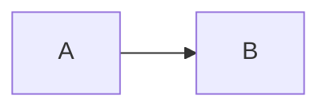

# Quill

A minimalist, cross-platform note-taking app with LaTeX-grade typography and rich embeds.

Notes are plain Markdown files in a folder you choose. They render in Computer Modern with KaTeX math, Mermaid diagrams, images, and sandboxed embeds for animations or web pages.

See [SPEC.md](SPEC.md) for the full specification.

## Writing notes

````markdown
# Title of the note

Inline math $e^{i\pi} + 1 = 0$ and display math:

$$\int_0^1 x^2\,dx = \tfrac13$$




::embed[assets/animation.html]
::embed[https://example.com/demo]
````

Paste or drop an image into the editor to save it into `assets/` and insert the link.

## Shortcuts

`Ctrl` on Linux and Windows, `Cmd` on macOS.

| Shortcut | Action |
|---|---|
| `Ctrl+O` | Open a folder of notes |
| `Ctrl+P` | Find or create a note |
| `Ctrl+E` | Switch between reading and writing |
| `Ctrl+\` | Show or hide the note list |
| `Ctrl+Shift+F` | Focus mode (`Esc` to leave) |

## Development

Requires Node.js, Rust and the [Tauri prerequisites](https://v2.tauri.app/start/prerequisites/).

```sh
npm install
npm run tauri dev     # run the app with hot reload
npm test              # frontend tests
cargo test --manifest-path src-tauri/Cargo.toml
```

### Checking how it looks and feels

Keep `npm run tauri dev` running while you work: frontend changes appear in the open window within a second, and Rust changes rebuild in a few seconds.

Open the `demo/` folder in the app (`Ctrl+O`). Its notes cover every feature: typography, math, diagrams, images and embeds. Walk through them after each change. Revert any edits made while testing with `git checkout demo/`.

## Releases

Push a tag such as `v0.1.0`. The `release` workflow builds installers for macOS, Linux and Windows into a draft GitHub release.
