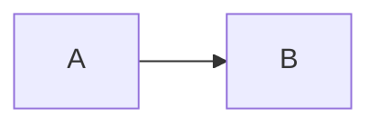

# Quill

A minimalist, cross-platform note-taking app with LaTeX-grade typography and rich embeds.

Notes are plain Markdown files in a folder you choose. They render in Computer Modern with KaTeX math, Mermaid diagrams, images, and sandboxed embeds for animations or web pages.

See [SPEC.md](SPEC.md) for the full specification.

## Writing notes

````markdown
# Title of the note

Inline math $e^{i\pi} + 1 = 0$ and display math:

$$\int_0^1 x^2\,dx = \tfrac13$$




::embed[assets/animation.html]
::embed[https://example.com/demo]
````

Paste or drop an image into the editor to save it into `assets/` and insert the link.

Exported PDFs always use the light theme. Your own HTML embeds can follow it: when exporting, Quill adds `#quill-theme=light` to their address, so check `location.hash` and switch to light colours.

## Shortcuts

`Ctrl` on Linux and Windows, `Cmd` on macOS.

| Shortcut | Action |
|---|---|
| `Ctrl+K` | All actions (searchable) |
| `Ctrl+N` | New note |
| `Ctrl+P` | Find or create a note |
| `Ctrl+E` | Switch between reading and writing |
| `Ctrl+S` | Save now (it also autosaves) |
| `Ctrl+Shift+E` | Export: page preview, paper and margins, Save PDF or Print… |
| `Ctrl+B` | Show or hide the note list |
| `Ctrl+Shift+F` | Focus mode (`Esc` to leave) |
| `Ctrl+O` | Open a folder (press again for the system browser) |
| `Ctrl+H` | Back to the start screen |

Move the pointer to the top edge of the window to show the bar with the note list, Read/Write toggle, save state and all actions.

## Sync (desktop and phone)

Quill can keep a folder in sync with a private cloud bucket (Cloudflare R2). It works offline, never overwrites a newer version, and when two devices edit the same note it keeps both: the other version is saved as `Name (conflict, device, date).md`.

Set up the server once from [sync-api/](sync-api/README.md), then in Quill press `Ctrl+K`, choose **Sync settings…**, paste this device's token (the server address is built in), tick **Sync this folder** and save. The first sync shows what it will copy and waits for your confirmation. Design: [docs/SYNC-SPEC.md](docs/SYNC-SPEC.md).

## Android

An Android app (64-bit ARM) is attached to each release. It keeps its notes inside the app and fills them through sync. See [docs/ANDROID.md](docs/ANDROID.md).

## Development

Requires Node.js, Rust and the [Tauri prerequisites](https://v2.tauri.app/start/prerequisites/).

```sh
npm install
npm run tauri dev     # run the app with hot reload
npm test              # frontend tests
cargo test --manifest-path src-tauri/Cargo.toml
```

### Checking how it looks and feels

Keep `npm run tauri dev` running while you work: frontend changes appear in the open window within a second, and Rust changes rebuild in a few seconds.

Open the `demo/` folder in the app (`Ctrl+O`). Its notes cover every feature: typography, math, diagrams, images and embeds. Walk through them after each change. Revert any edits made while testing with `git checkout demo/`.

## Releases

Push a tag such as `v0.1.0`. The `release` workflow builds installers for macOS, Linux and Windows into a draft GitHub release.
