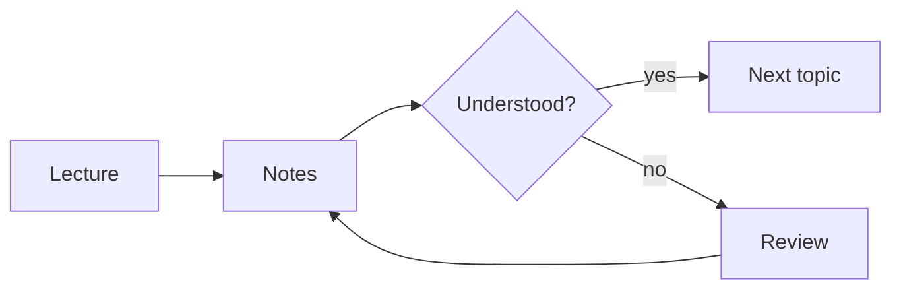
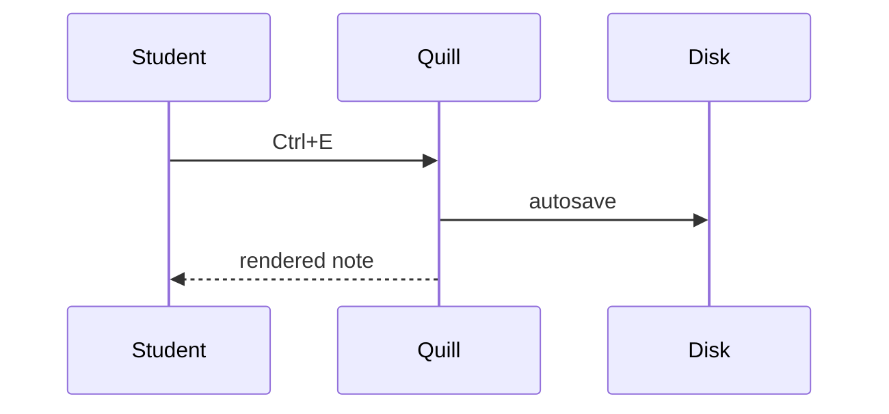

# Diagrams and embeds 2

## A flowchart

## A sequence diagram

## An image

## An animated embed

A local HTML file, running in a sandbox:

::embed[assets/wave.html]

## A broken embed

Plain http and paths outside the folder are refused with a message:

::embed[http://example.com]
