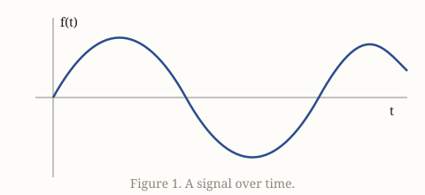

# A nested note

This note lives in `lectures/`, so its image link goes up one folder:

Images pasted into this note are saved to the shared `assets/` folder and linked the same way.

Back to the [welcome note](../Welcome.md).
