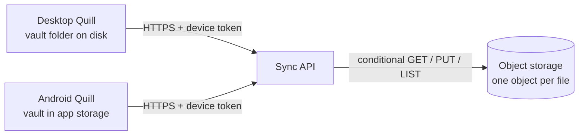

# Quill Sync: Spec

Read and write the same notes from the desktop app and an Android app, kept in sync through cloud storage.

Status: specified, not built. Decisions are recorded below with the alternatives that were considered.

## Goals

- The same vault on desktop (Windows, Linux, macOS) and Android.
- **Local-first**: each device keeps a full copy. Reading and writing never wait for the network; sync runs in the background.
- Works offline; catches up when the connection returns.
- Never loses an edit. When two devices change the same note, both versions survive.
- Cheap enough to run for one person at near-zero cost.

## Non-goals (v1)

- Real-time co-editing (two cursors in one note).
- Sharing notes with other people or a web version.
- Version history beyond what the storage provider keeps.

## Architecture

Three parts:

1. **Object storage** holds one object per vault file (`notes/<vault path>`), including `assets/`. Storage is private; devices never hold its credentials.
2. **Sync API**, a small serverless function in front of the storage. It checks the device token and passes reads, writes and listings through, forwarding the version checks. It holds no state of its own.
3. **Sync engine** inside each Quill app (Rust side). It compares the local folder, the remote listing and its own record of the last sync, then uploads, downloads or flags conflicts.

Why an API instead of devices talking to storage directly: storage keys on a phone are hard to protect and impossible to scope tightly. A per-device token can be revoked if a phone is lost, without touching the other devices.

**Decision 1, provider: Cloudflare R2 with the sync API on Cloudflare Workers.** The free tier covers a personal vault (10 GB storage, free egress) and the API runs next to the bucket. Considered: AWS S3 with Lambda (small cost, more setup) and a third-party synced folder (no control over conflicts). R2 enforces conditional writes (`If-Match`, `If-None-Match`); confirmed against the real bucket in S1.

## Sync protocol

### What each device remembers

A local sync record per file, written after every successful sync:

| Field | Meaning |
|---|---|
| `path` | Vault-relative path |
| `hash` | SHA-256 (Secure Hash Algorithm) of the content last synced |
| `etag` | Storage version tag (ETag) of the object last synced |

This record is the *base*: the last state both sides agreed on.

### One sync pass

1. List remote objects (path and ETag).
2. Hash local files.
3. For each path, compare local and remote against the base:

| Local vs base | Remote vs base | Action |
|---|---|---|
| Same | Same | Nothing |
| Changed | Same | Upload with `If-Match: <base etag>` (new files: `If-None-Match: *`) |
| Same | Changed | Download, overwrite local |
| Changed | Changed, same content | Update the base only |
| Changed | Changed, different | **Conflict** (below) |
| Deleted | Same | Delete remote |
| Same | Deleted | Delete local |
| Deleted | Changed | Keep the remote version (an edit beats a delete) |
| Changed | Deleted | Re-upload the local version |

4. If an upload is refused because the remote changed since the listing (HTTP 412), treat that file as a conflict.

### Conflicts

- The remote version keeps the note's name. The local version is saved beside it as `Name (conflict, <device>, <date>).md` and uploaded, so every device sees both.
- Quill shows "Conflict" in the pill and lists conflict files in the switcher, so they are easy to find and merge by hand.

**Decision 2, conflicts: conflict copies.** Simple and never loses text; conflicts are rare for one person with two devices. Considered: automatic merge with a CRDT (Conflict-free Replicated Data Type) such as Automerge, rejected for its complexity and different storage format.

### When sync runs

- On app start and when the app comes to the foreground (Android resume).
- After a save, debounced by a few seconds.
- Every few minutes while the app is open.
- Manually, from the actions panel ("Sync now").

### Renames and assets

- A rename syncs as delete + create. Content is unchanged, so no conflict.
- Assets (images, HTML embeds) sync like notes. Files over a size limit (for example 20 MB) are skipped with a warning.

## Security

- HTTPS only. The bucket is private.
- One token per device, created when the device is paired, revocable on its own. Stored in the operating system's secure storage (Windows Credential Manager, Android Keystore), not in plain files.
- The API only allows paths under the vault prefix and rejects `..` and absolute paths, like the desktop app does today.

**Decision 3, encryption: provider encryption at rest.** Nothing extra to manage. Considered: end-to-end encryption, which needs a passphrase on every device and loses the notes if it is lost; it can be added later as S4 without changing the protocol.

## Apps

### Desktop

- Settings: sync on/off, API address, device pairing.
- Sync state in the pill: Synced, Syncing…, Offline, Conflict.
- The vault folder stays the source of truth on disk; sync works alongside it.

### Android

- A Tauri 2 Android build of the same codebase, so the renderer, math, diagrams and editor match the desktop.
- The vault lives in app storage and is filled by sync (no folder picker).
- Phone layout: single column, note list as a full-screen panel, larger touch targets.

**Decision 4, Android scope: read and edit in the first version.** The editor already works in a webview, and sync handles the rest. Considered: read-only first.

To verify early: embeds (iframes over Quill's asset protocol) and the official plugins Quill uses, on Android.

## Desktop sync, as built

- **Engine** (`src-tauri/src/sync/`): `plan.rs` is the decision table, one test per row; `engine.rs` scans the folder, lists the cloud, and runs one pass against a `Remote` trait (tested with an in-memory remote that has R2's version rules); `http.rs` is the real remote.
- **Sync record:** `<vault>/.quill/sync.json`, one `{hash, etag}` per file. Hidden folders, `node_modules`, temporary files, names the API would refuse, and files over 20 MB are skipped.
- **Both sides have it, no base:** the contents are compared before anything is called a conflict, so two devices that already hold the same note do not produce a copy.
- **Progress is kept:** if the connection drops mid-pass, what was synced stays synced and the next pass continues.
- **One folder:** sync is switched on for one folder at a time (saved in the app's settings), so opening another folder never mixes two vaults into one bucket.
- **First sync asks first:** a folder with no sync record shows what Quill will upload or download, and runs only after you confirm. The backend refuses an unconfirmed first run too.
- **Settings** (action "Sync settings…"): server address (https, or http on this machine for development), device token, device name. The token is kept in the app's settings file, readable only by the user on Linux and macOS, and never sent back to the interface. Operating-system secure storage is S4.
- **Status** in the pill: Synced, Syncing…, Offline, "Check sync token", "Sync failed · Retry", or "n conflicts" (click to list the copies in the note finder). Conflicts also show a toast.
- **When it runs:** after opening the folder, 3 s after a save, every 5 minutes, when the window returns after 30 s, when the network returns, and from "Sync now". Automatic runs closer than 5 s apart are skipped.
- **Open note:** if sync downloads a new version of the note that is open (and it has no unsaved edits) it reloads; if sync deleted it, Quill returns to the start screen.

## Cost (one person)

A vault of notes and images is a few hundred MB at most. On R2 this stays inside the free tier; on S3 it costs cents per month.

## Milestones

1. **S1, backend:** bucket, sync API with device tokens, conditional writes. *Done: deployed at `https://quill-sync.pmoragas.workers.dev` and verified against the real R2 bucket (`npm run smoke`): R2 enforces `If-Match` and `If-None-Match`, so the Worker needs no check of its own.*
2. **S2, desktop sync:** sync engine, sync record, conflict copies, pill status. *Done: see "Desktop sync, as built" below.*
3. **S3, Android:** Tauri Android build, phone layout, sync on resume. *Built: see [ANDROID.md](ANDROID.md). The APK builds and is signed, and the phone layout is tested in an emulated browser; it has not yet been run on a real device.*
4. **S4, hardening:** secure token storage, size limits; end-to-end encryption if wanted later.

## Testing

- Sync engine: unit tests for every row of the decision table, using an in-memory store.
- Two-device scenario tests: edit both offline, reconnect, expect a conflict copy and no lost text.
- API: rejects a missing or revoked token, paths outside the vault, and stale `If-Match`.
